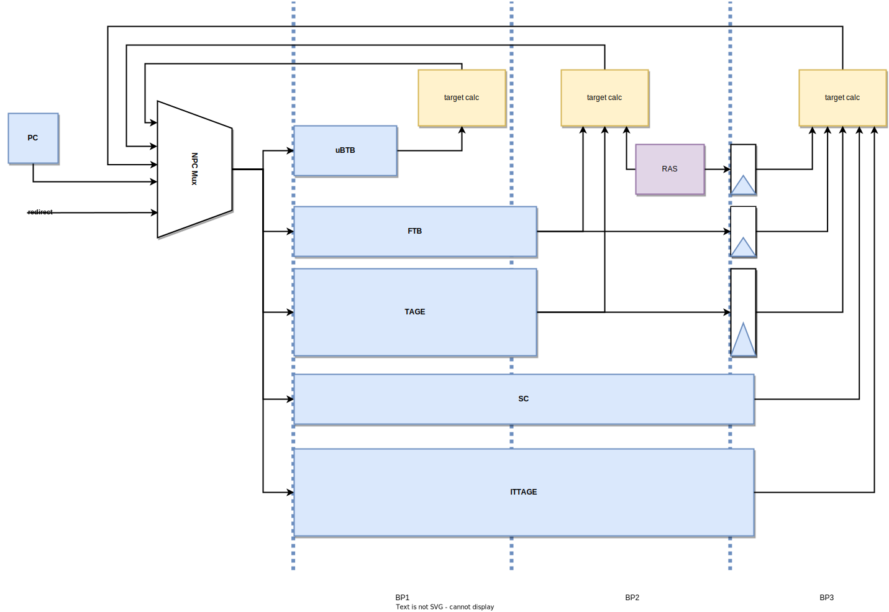

# 香山处理器
## 1. 主要功能

香山处理器是一个开源的工业级别处理器，是乱序六发射结构设计，支持RISC-V指令集，前端流水线负责取指，后端流水线负责处理。

阅读版本为：南湖架构。

## 2. 主要功能模块

香山处理器前端流水线包括分支预测单元、取指单元、指令缓冲等单元，顺序取指。后端包括译码、重命名、重定序缓冲、保留站、整型/浮点寄存器堆、整型/浮点运算单元。结构如下图：


香山官方文档目录结构如下：
    
```bash
.
├── scripts              # 生成 Verilog 及仿真使用的一些脚本
├── src                  # 结构设计与验证代码
│   └── main               # 结构设计代码
│       └── scala
│           ├── device         # 仿真用的一些外设
│           ├── system         # SoC 的描述
│           ├── top            # 顶层文件
│           ├── utils          # 一些基础硬件工具库
│           ├── xiangshan      # 香山 CPU 部分的设计代码
│           └── xstransforms   # 一些 FIRRTL Transforms
├── fudian               # 香山浮点子模块
├── huancun              # 香山 L2/L3 缓存子模块
├── difftest             # 香山协同仿真框架
├── ready-to-run         # 预先编译好的 nemu 动态链接库, 和一些负载
└── rocket-chip          # 用来获取 Diplomacy 框架（等待上游拆分）
```

```./src/main/scala/xiangshan```包含了CPU设计代码，笔者阅读的主要是```src/main/scala/utils```和```src/main/scala/xiangshan```。

```./src/main/scala/xiangshan```目录如下：

```bash
xiangshan
├── backend
├── cache
├── frontend
└── mem
```

```frontend```目录包含了前端流水线的设计代码，其中就包括笔者要分析的分支预测单元。

## 3. 选择分析的功能模块

笔者选择分析的模块是前端的分支预测器，分支预测单元采用一种多级混合预测的架构，其主要组成部分包括 下一行预测器（Next Line Predictor，以下简称 NLP）和 精确预测器（Accurate Predictor，以下简称 APD）。其中，NLP 是一个 uBTB (micro BTB)，APD 由 FTB1、TAGE-SC、ITTAGE、RAS 组成。NLP 提供无空泡的预测，在预测请求的下一拍就可以得到预测结果。APD 各组成部分的延迟在 2~3 拍之间。其中，FTB、TAGE、RAS 的延迟为 2 拍；SC、ITTAGE 的延迟为 3 拍。一次预测会经历三个流水级，每一个流水级都会产生新的预测内容。这些分布于不同流水级的预测器组成了一个覆盖预测器 (overriding predictor)，结构如下图：



香山使用新型敏捷硬件开发语言Chisel，Chisel是一门以Scala为宿主语言开发的硬件构建语言，chisel转换成verilog的过程为：编写的Chisel代码首先经过Chisel编译器生成AST中间数据，然后经过Firrtl编译器，再将AST数据转换成Firrtl代码，最后经过Firrtl编译器将Firrtl文件转换成Verilog代码。

## 4. 结合香山代码分析Chisel面向对象思想

Chisel是一门以Scala为宿主语言开发的硬件构造语言，Chisel的工作过程是将其编写的程序通过一个中间表示(Intermidiate Representation, IR)翻译为对应的 Verilog代码。

### 4.1 Generators: Parameters

Verilog中的模块都是静态的，即模块的端口数量和类型都是固定的，而Chisel中的模块依托于Scala的类，因此可以使用Scala的参数化特性，使得模块的端口数量和类型可以在运行时确定，这样的模块被称为生成器，利用生成器可以大大减少重复建造相同类型不同规模的轮子。

在香山的工具库中大量使用了参数：

```Scala
class RawDataModuleTemplate[T <: Data](
  gen: T,           // 数据类型
  numEntries: Int,  // 模块的端口数量
  numRead: Int,     // 读端口数量
  numWrite: Int,    // 写端口数量
  isSync: Boolean,  // 是否同步
  optWrite: Seq[Int] = Seq()    // 可选写端口
) extends Module {
  val io = IO(new Bundle {
    val rvec  = Vec(numRead,  Input(UInt(numEntries.W)))
    val rdata = Vec(numRead,  Output(gen))
    val wen   = Vec(numWrite, Input(Bool()))
    val wvec  = Vec(numWrite, Input(UInt(numEntries.W)))
    val wdata = Vec(numWrite, Input(gen))
  })

  val data = Reg(Vec(numEntries, gen))

  val wen = io.wen.zipWithIndex.map{ case (en, i) => if (optWrite.contains(i)) RegNext(en) else en }
  val wvec = io.wvec.zipWithIndex.map{ case (v, i) => if (optWrite.contains(i)) RegEnable(v, io.wen(i)) else v }
  val wdata = io.wdata.zipWithIndex.map{ case (d, i) => if (optWrite.contains(i)) RegEnable(d, io.wen(i)) else d }

  // read ports
    /* 此处省略读端口代码 */
  // write ports
    /* 此处省略写端口代码 */
}
```

### 4.2 Chisel的函数式编程

高阶函数指的是看以函数作为参数或返回值的函数，用Scala提供的高阶函数(higher-order function),我们能将原本Verilog代码大量重复且晦涩难懂的代码，简洁地表示出来。

```Scala
object ParallelOperation {
  def apply[T](xs: Seq[T], func: (T, T) => T): T = {    // func为传入的函数参数
    require(xs.nonEmpty)
    xs match {
      case Seq(a) => a
      case Seq(a, b) => func(a, b)
      case _ =>
        apply(Seq(apply(xs take xs.size/2, func), apply(xs drop xs.size/2, func)), func)
    }
  }
}

object ParallelOR {
  def apply[T <: Data](xs: Seq[T]): T = {
    ParallelOperation(xs, (a: T, b: T) => (a.asUInt | b.asUInt).asTypeOf(xs.head))  // 传入的函数参数为(a: T, b: T) => (a.asUInt | b.asUInt).asTypeOf(xs.head)，是一个函数字面量。
  }
}
```

Scala中函数为头等公民，我们可以写一个未命名的函数字面量，然后可以把它当成一个值传递到其它函数或是赋值给其它变量。

### 4.3 Chisel的面向对象编程

Chisel可以使用其宿主语言Scala的面向对象编程特征，类、抽象类(abstract class)和特质(trait)。类和抽象类我们都比较熟悉，特质则抽象类有所不同：1.一个类可以继承多个特质。2.特质不能有构造函数参数，这意味着特质不能实例化。

Scala为单例类提供了一个称为object的语言特性。不能实例化一个object，可以直接引用它。这使它们类似于Java静态类。

Scala中伴随对象(copanion object)也很常见，当一个类和一个对象共享相同的名称并在同一个文件中定义时，该对象称为伴随对象。在class/object名称之前使用new时，它将实例化类。如果不使用new，它将引用对象。伴随对象通常用于定义工厂方法。

```Scala

class ImmExtractor(numSrc: Int, dataBits: Int)(implicit p: Parameters) extends XSModule {
  val io = IO(new Bundle {
    val uop = Input(new MicroOp)
    val data_in = Vec(numSrc, Input(UInt(dataBits.W)))
    val data_out = Vec(numSrc, Output(UInt(dataBits.W)))
  })
  io.data_out := io.data_in
}

object ImmExtractor {
  def apply(params: RSParams, uop: MicroOp, data_in: Vec[UInt], pc: Option[UInt], target: Option[UInt])
           (implicit p: Parameters): Vec[UInt] = {
    val immExt = if (params.isJump) {
      val ext = Module(new JumpImmExtractor)
      ext.jump_pc := pc.get
      ext.jalr_target := target.get
      ext
    }
    else if (params.isAlu) { Module(new AluImmExtractor) }
    else if (params.isMul) { Module(new MduImmExtractor) }
    else if (params.isLoad) { Module(new LoadImmExtractor) }
    else { Module(new ImmExtractor(params.numSrc, params.dataBits)) }
    immExt.io.uop := uop
    immExt.io.data_in := data_in
    immExt.io.data_out
  }
}

class JumpImmExtractor(implicit p: Parameters) extends ImmExtractor(2, 64) {
  val jump_pc = IO(Input(UInt(VAddrBits.W)))
  val jalr_target = IO(Input(UInt(VAddrBits.W)))

  when (SrcType.isPc(io.uop.ctrl.srcType(0))) {
    io.data_out(0) := SignExt(jump_pc, XLEN)
  }
  // when src1 is reg (like sfence's asid) do not let data_out(1) be the jalr_target
  when (SrcType.isPcOrImm(io.uop.ctrl.srcType(1))) {
    io.data_out(1) := jalr_target
  }
}
```


